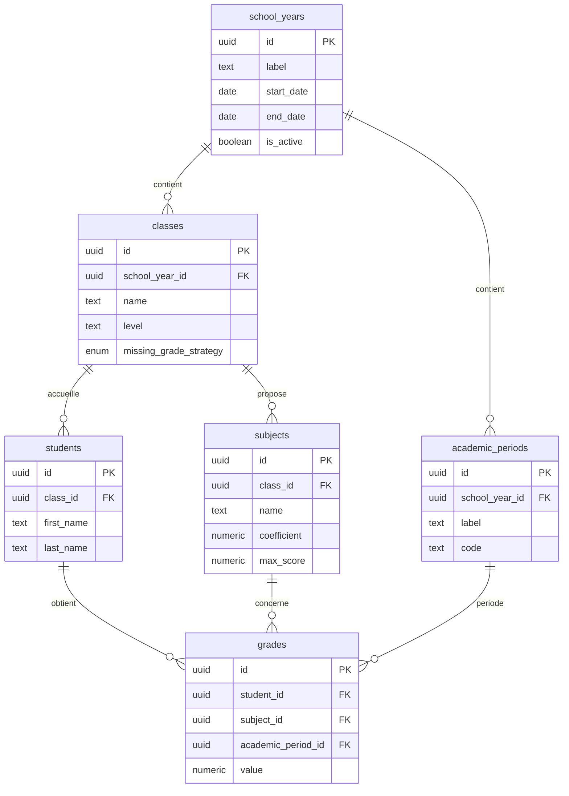

# Architecture — Moyennes Scolaires (Secondaire)

Application web de gestion et calcul des moyennes scolaires pour le secondaire.

## Stack technique

| Couche        | Technologie                          |
|---------------|--------------------------------------|
| Frontend      | React 18 + TypeScript + Vite         |
| Styles        | Tailwind CSS                         |
| Base de données | Supabase (PostgreSQL + Auth + RLS) |
| Export PDF    | jsPDF + jspdf-autotable (à implémenter) |
| Routing       | React Router v6                      |
| État / données | TanStack Query (React Query)        |

## Schéma relationnel



## Règles métier

1. **Notes sur 20** — Contrainte `CHECK (value >= 0 AND value <= 20)` en base.
2. **Coefficient par matière** — Moyenne pondérée : `Σ(note × coef) / Σ(coef)`.
3. **Notes manquantes** — Deux stratégies configurables :
   - `exclude` : la matière est ignorée (coef non compté).
   - `zero` : la note vaut 0 (coef compté).
4. **Héritage de configuration** — Une classe peut surcharger `missing_grade_strategy` ; sinon `app_settings` s'applique.
5. **Calcul côté application** — La logique de calcul vit dans `src/lib/utils/grades/` (testable, indépendante de l'UI).

## Structure des dossiers

```
/
├── docs/
│   └── ARCHITECTURE.md          # Ce document
├── supabase/
│   ├── migrations/
│   │   └── 001_initial_schema.sql
│   └── seed.sql                 # Données de démo
├── public/
│   └── favicon.svg
├── src/
│   ├── main.tsx                 # Point d'entrée React
│   ├── App.tsx                  # Routes principales
│   ├── index.css                # Directives Tailwind
│   │
│   ├── types/                   # Types TypeScript (miroir du schéma DB)
│   │   ├── index.ts
│   │   ├── database.ts
│   │   └── grades.ts
│   │
│   ├── lib/
│   │   ├── supabase/
│   │   │   ├── client.ts        # Client Supabase
│   │   │   └── queries/         # Requêtes typées par entité
│   │   │       ├── classes.ts
│   │   │       ├── students.ts
│   │   │       ├── subjects.ts
│   │   │       └── grades.ts
│   │   │
│   │   ├── utils/
│   │   │   └── grades/          # ★ Logique métier de calcul (isolée)
│   │   │       ├── calculateAverage.ts
│   │   │       ├── rankStudents.ts
│   │   │       ├── classStatistics.ts
│   │   │       └── index.ts
│   │   │
│   │   └── pdf/                 # Génération des bulletins PDF
│   │       └── generateReportCard.ts
│   │
│   ├── hooks/                   # Hooks React personnalisés
│   │   ├── useClasses.ts
│   │   ├── useStudents.ts
│   │   ├── useSubjects.ts
│   │   ├── useGrades.ts
│   │   └── useDashboard.ts
│   │
│   ├── components/
│   │   ├── ui/                  # Composants génériques (Button, Input, Table…)
│   │   ├── layout/              # Sidebar, Header, PageLayout
│   │   ├── classes/             # CRUD classes
│   │   ├── students/            # CRUD élèves
│   │   ├── subjects/            # CRUD matières
│   │   ├── grades/              # Saisie et affichage des notes
│   │   └── dashboard/           # Tableau de bord enseignant
│   │
│   ├── pages/                   # Pages routées (composition de composants)
│   │   ├── DashboardPage.tsx
│   │   ├── ClassesPage.tsx
│   │   ├── StudentsPage.tsx
│   │   ├── SubjectsPage.tsx
│   │   ├── GradesPage.tsx
│   │   └── SettingsPage.tsx
│   │
│   └── contexts/
│       └── AppSettingsContext.tsx
│
├── package.json
├── vite.config.ts
├── tailwind.config.js
├── tsconfig.json
└── .env.example
```

## Séparation des responsabilités

| Couche | Rôle | Exemple |
|--------|------|---------|
| `types/` | Contrats de données | `Grade`, `Student`, `MissingGradeStrategy` |
| `lib/utils/grades/` | Calcul pur (sans React) | `calculateStudentAverage(grades, strategy)` |
| `lib/supabase/queries/` | Accès données | `fetchStudentsByClass(classId)` |
| `hooks/` | État serveur + cache | `useStudents(classId)` via React Query |
| `components/` | Présentation | `GradeInput`, `RankingTable` |
| `pages/` | Orchestration | Assemble hooks + composants |

## Flux de calcul des moyennes


## Prochaines étapes d'implémentation

1. Initialiser le projet Vite (`npm create vite@latest`)
2. Configurer Supabase (`.env` avec `VITE_SUPABASE_URL` et `VITE_SUPABASE_ANON_KEY`)
3. Appliquer la migration : `supabase db push`
4. Implémenter les CRUD entité par entité
5. Brancher le tableau de bord sur les utilitaires de calcul
6. Ajouter l'export PDF des bulletins
